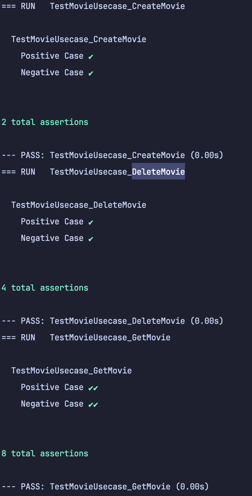
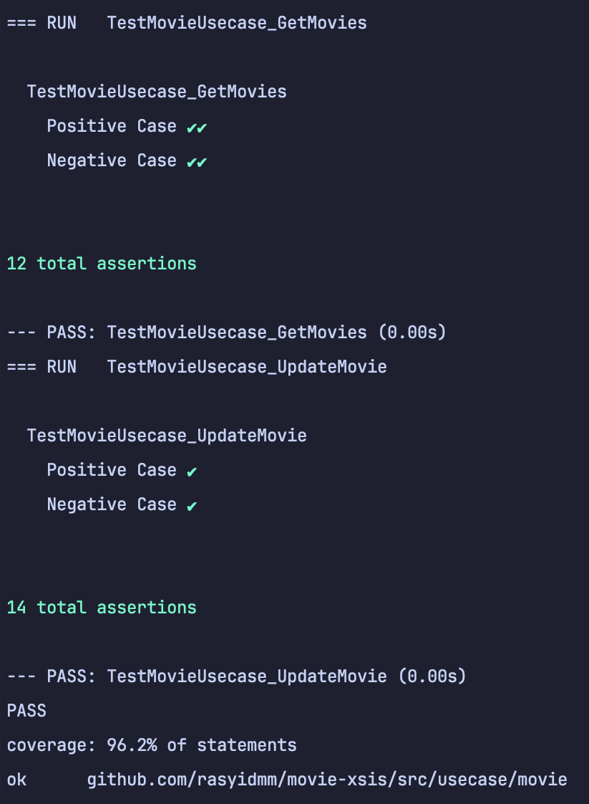

# Movie Xsis
    Restful for Movie Test

## Prerequisites
    - Go 1.22
    - Fiber
    - Mysql
    - Gorm
    - Swaggo
    - Docker

## How to use
```bash
    git clone github.com/rasyidmm/movie-xsis
    cd movie-xsis
    docker-compose up -d
```

## IP
    Server : http://172.27.0.2:3000/
    Database : 172.27.0.3
    Swagger : http://172.27.0.2:3000/swagger/index.html

## Postman
    dapat melakukan dengen postman
- [Link Postman](https://github.com/rasyidmm/movie-xsis/blob/master/movie-xsis.postman_collection.json)

## Unit Test
```bash
    cd src/usecase/movie
    go test -v -cover
```



